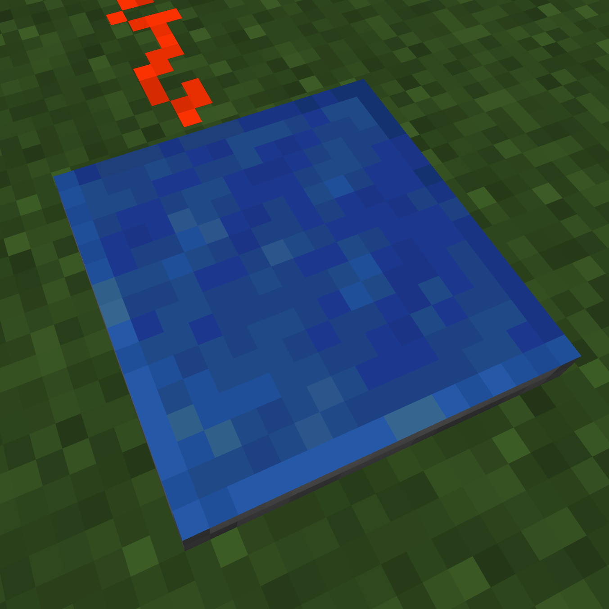
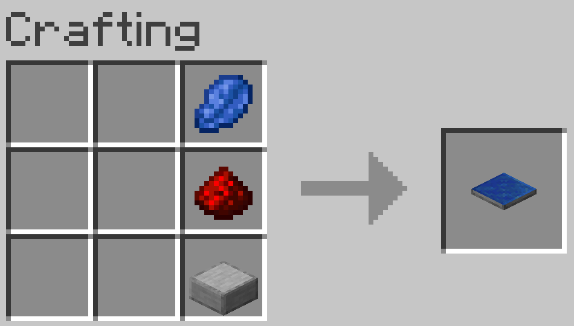

# Player Detector

A server-side Fabric mod that adds a player detector block. When a player stands on it, the block emits a redstone signal.

## Features

- Detects players standing on the block and outputs redstone signal (level 15)
- Works server-side only - vanilla clients can join and use it without needing the mod
- Waterloggable
- Flat 2-pixel height profile (like a pressure plate)

## License

MIT