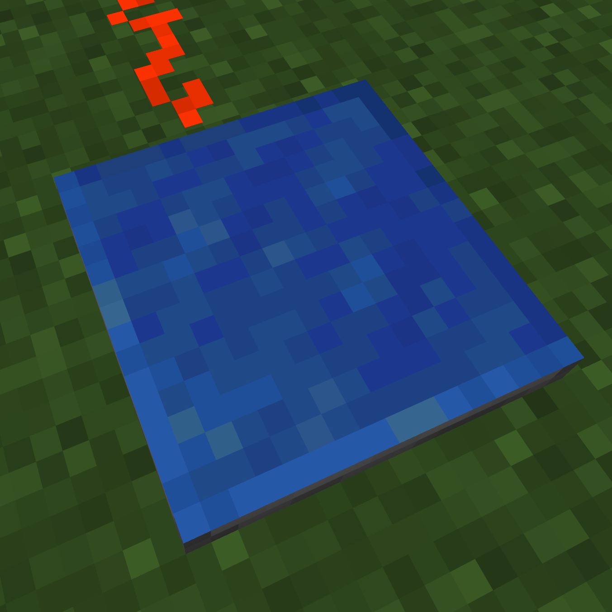
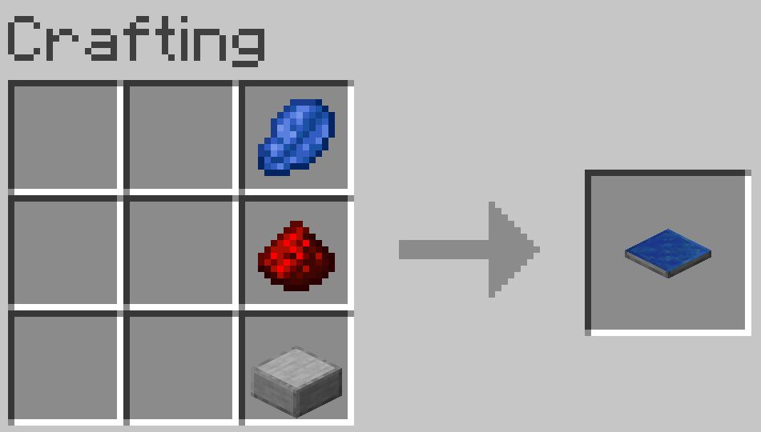

# Player Detector

A Fabric mod that adds a redstone block that detects when players stand on it.

## Features

- **Player Detection**: Emits a redstone signal (level 15) when a player stands on it
- **Flat Profile**: Only 2 pixels tall, similar to a pressure plate
- **Waterloggable**: Can be placed underwater
- **Player-Only**: Only detects players, not other entities

## Screenshots

## Pandorical

Player Detector registers its block and item models through Pandorical's content sync.

**The Pandorical mod must be installed client-side** to see the Player Detector block and item rendered with their custom textures. Without it, the block still functions (emits redstone signal when a player stands on it), but a connecting client cannot see it rendered correctly.

## Development

Installing is in [DEVELOPMENT.md](DEVELOPMENT.md).

## License

MIT, see [LICENSE](LICENSE).
